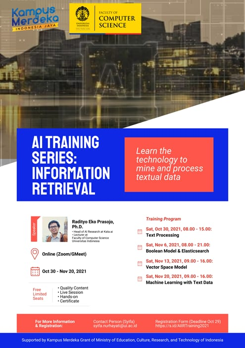

# AI Training Series UI 2021

AI Training Series hosted by University of Indonesia with general topic "Information Retrieval (IR)" trained by Radityo Eko Prasojo, Ph.D.

## Specific Topics

- Text Processing
- Boolean Model and Elasticsearch
- Vector Space Model
- Machine Learning with Text Data

## Banner Information

